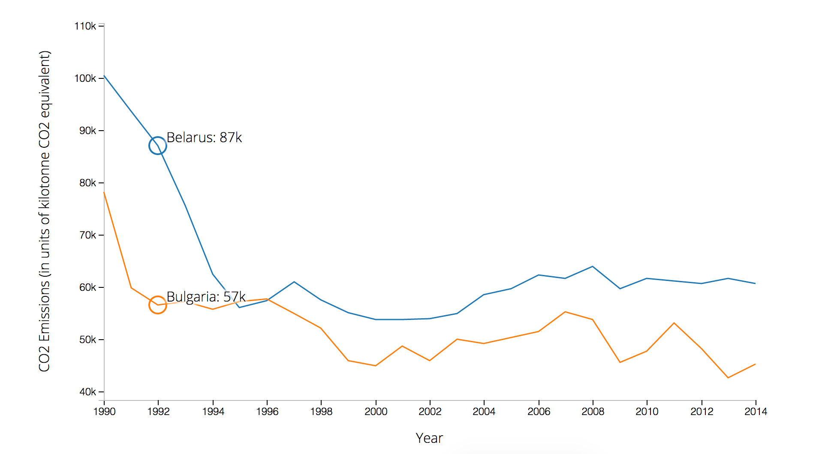
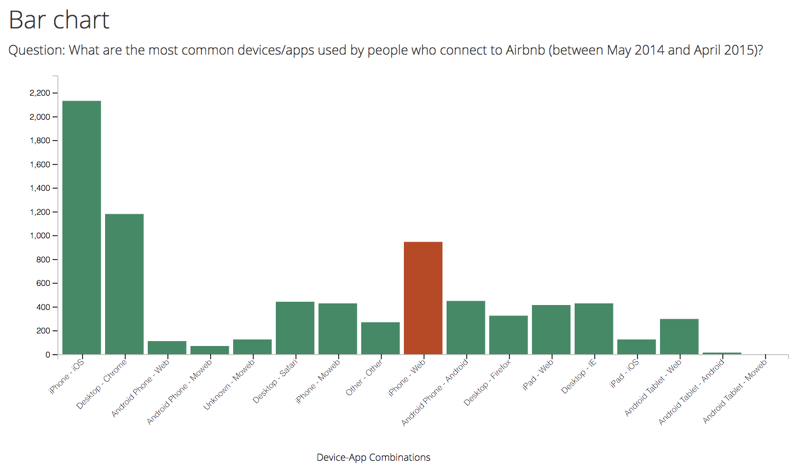

# tp2-d3

For the second technical progress checkin, you'll be using the [D3](https://d3js.org/) framework to create a bar chart. In doing so, you'll demonstrate a strong familiarity with the following skills:
- Managing a project using **git** and **GitHub**
- Use **HTML** and **CSS** to create and style elements on a web-page
- Wrangle `.csv` data using **JavaScript**
- Use the **D3** framework to build a bar chart.
- Host your website on a server.

## Preview
Complete example of visualization.

Example of what should be displayed upon hovering on a bar.

## Dataset
This assignment uses a dataset from Airbnb between May 2014 and April 2015. The data was presented as a design challenge on Databits ([challenge here](http://databits.io/challenges/airbnb-user-pathways-challenge)).

## Instructions
Instructions are included as in-line comments in your `js/script.js` file (all `html` and `css` code is already written). You **do not** need to create a pixel-perfect representation of the screenshot provided, but attention to detail should be paid to each element on the page. In your `script.js` file, you'll need to do the following to render your bar chart (more instructions inline):

- **Create chart wrappers**: Append `svg` and `g` elements for containing your chart
- **Data prep**: Aggregate your data by `device-app-combo` (i.e., create _counts_ of the number of instances of each combination)
- **Define scales and axes**: Define the functions that you will use to position elements and render your axes
- **Rendering axes and axis labels**: Draw the axes on the chart
- **Drawing data**: Use the `data-join` to draw elements on your screen

Then, you'll need to **host your webpage** so that it's easily accessible to read/grade. 

## References
- [Airbnb and Databits](http://databits.io/challenges/airbnb-user-pathways-challenge)
- [D3](https://d3js.org/)
- [D3 - Bar Chart Block](https://bl.ocks.org/mbostock/3885304)
- [D3 - Rotated axis labels](https://bl.ocks.org/mbostock/4403522)
- [D3 - Mouseover event](https://bl.ocks.org/mbostock/3902569)
- [D3 Book Chapter](https://info474-s17.github.io/book/introduction-to-d3-js.html)
