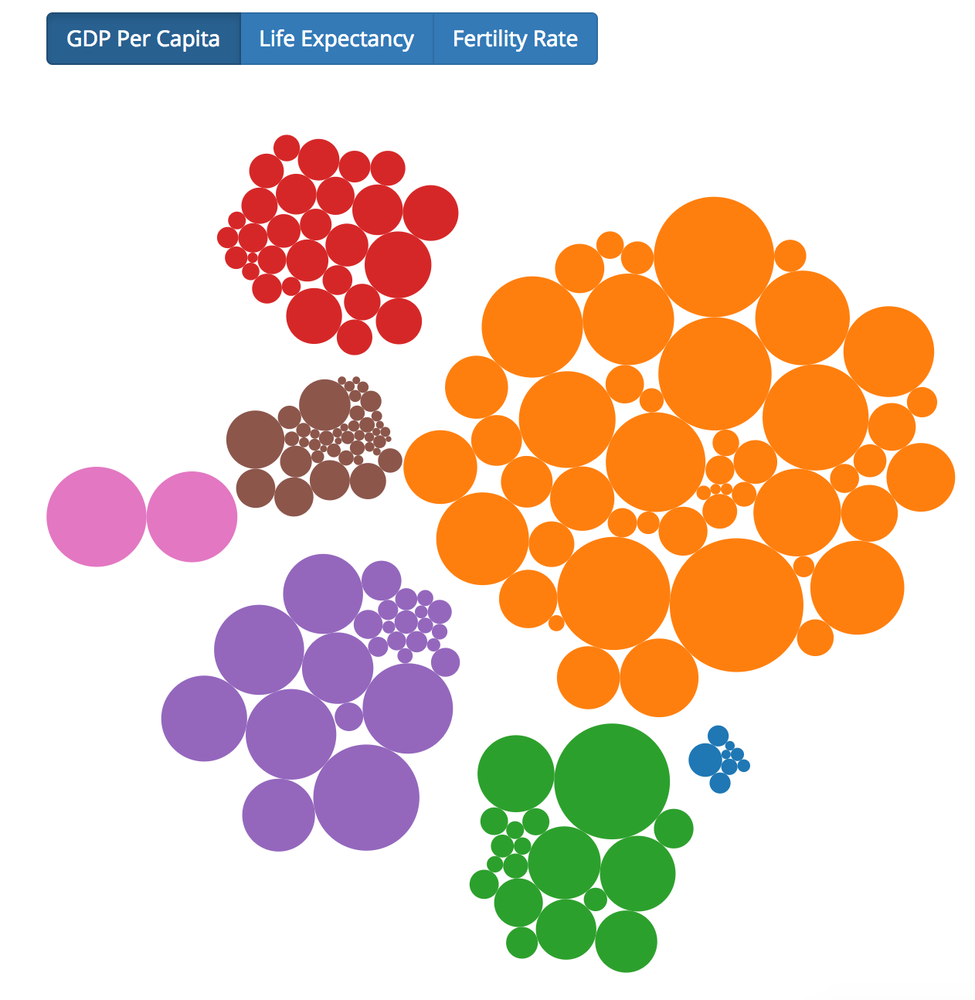

# tp3-hierarchy

========================   

[Click HERE](http://sunho0301.github.io)  

========================    


In this exercise, you'll follow the instructions below to transform a treemap into a circle-pack layout. This repository **already has** a working version of the treemap built. What you'll need to do is build a **circle-pack** layout instead. Your final product should look like this:



## Instructions

As it turns out, it's really similar to build a circle-pack layout as a treemap. However, there are a few changes you'll need to make:

- Append an `svg` element and a `g` element (to your `svg`) to your main `div` (you'll need this to render `circle` elements). 
    - Make sure to set the `width` and `height` of your `svg` as the `diameter` variable
- Instead of you `treemap` function that you created with `d3.treemap()`, you should create a pack layout function returned by the `d3.pack()` function. This will allow you to compute a _pack_ layout instead of a _treemap_ layout. 
    - Make sure to use the `.size` method of your `pack` object to set the size (width and height). Both should be set to your `diameter` variable, passed into the `.size` method as a two-element array.
- When you create your `root` data, make sure to **sort** it using this function: 
    ```javascript
            .sort(function(a, b) {
                return b.value - a.value;
            });
    ```
- In your `draw` function, you'll pass your hierarchical data to your `pack` function (in leiu of the `treemap`) function to compute your data layout
- Rather than append `div` elements, you should append `circle` elements to your `g`. To position the circles, you can use the `x`, `y`, and `r` variables that get computed by the `pack` layout.